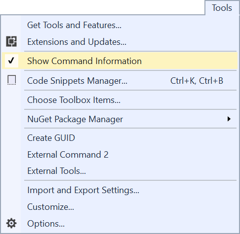

# VSCT info extension

This extension shows the group and menu identifiers of existing commands to make it easy to find out where to place your custom commands.

## Using the feature
Click on **Tools -> Show Command Information** to enable the command information to be shown.

Once enabled, you can now CTRL+Shift+Left-Click any command in any menu or toolbar to see the information about it's GUIDs, IDs and groups and menu hierarchy.

## License
[Apache 2.0](LICENSE) 