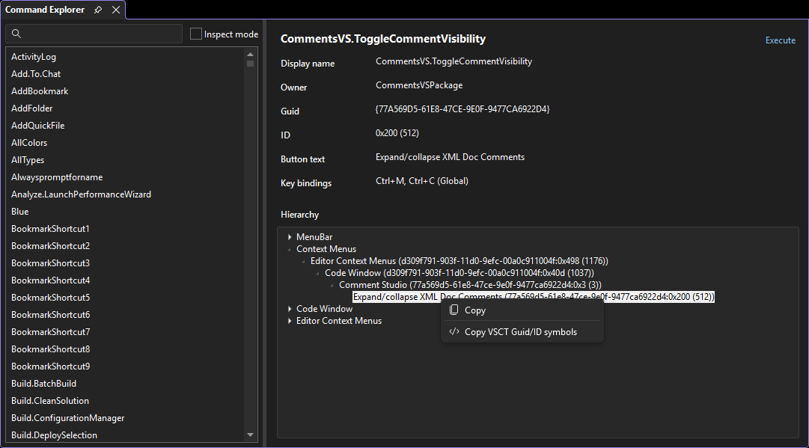

# Command Explorer

[](https://github.com/madskristensen/CommandTableInfo/actions/workflows/build.yaml)
[](https://github.com/sponsors/madskristensen)

> **The essential tool for Visual Studio extension authors.** Explore every command, menu, toolbar, and key binding in Visual Studio — and find the exact GUIDs, IDs, and placement hierarchy you need for your `.vsct` files.

Download from the [Visual Studio Marketplace](https://marketplace.visualstudio.com/items?itemName=MadsKristensen.CommandExplorer) or get the [CI build](http://vsixgallery.com/extension/1a973c52-a674-48d8-a276-65ddab1ac598/).

## Why you need this

If you've ever written a Visual Studio extension, you've hit this wall: *"Where do I place my command? What's the GUID and ID of that menu group?"* The answers are buried across dozens of documentation pages, header files, and SDK constants.

**Command Explorer puts it all in one searchable tool window.**

- 🔍 **Search thousands of commands** by name, GUID, ID, or key binding
- 🏗️ **See the full menu hierarchy** — know exactly where a command lives
- 📋 **Copy VSCT symbols** with one click — ready to paste into your `.vsct` file
- 🎯 **Inspect mode** — point at any menu item in VS to instantly look it up
- 📦 **Identify the owner** — see which package registered each command

## Getting started

Open the tool window from **View → Other Windows → Command Explorer**.



## Features

### Search and filter

Type in the search box to instantly filter commands. You can search by:

- **Command name** — e.g. `Edit.Copy`, `File.SaveAll`
- **GUID** — with or without braces/dashes
- **ID** — decimal (`258`) or hex (`0x102`)
- **Key binding** — e.g. `Ctrl+S`

### Command details

Select any command to see its full details:

| Field | Description |
|-------|-------------|
| **Display name** | The localized name shown in menus |
| **Owner** | The VS package that registered the command |
| **GUID** | The command set GUID, with known symbol names (e.g. `guidVSStd97`) |
| **ID** | Numeric ID in hex and decimal, with known enum names (e.g. `cmdidCopy`) |
| **Button text** | The text shown on the button/menu item |
| **Key bindings** | All keyboard shortcuts with their scope |

### Menu hierarchy

The hierarchy tree shows every place a command appears in the Visual Studio UI — menus, toolbars, and context menus — with the full parent chain and GUID:ID pairs at each level.

This is exactly what you need to fill in the `<Parent>` element in your `.vsct` files.

### Copy VSCT symbols

Right-click any node in the hierarchy tree and select **Copy VSCT Symbols** to get a ready-to-paste snippet:

```xml
<GuidSymbol name="guidVSStd97" value="{5efc7975-14bc-11cf-9b2b-00aa00573819}">
  <IDSymbol name="cmdidCopy" value="0x000f" />
</GuidSymbol>
```

### Inspect mode

Check the **Inspect mode** checkbox, then hold **Ctrl+Shift** and click any command in any menu or toolbar. Command Explorer will instantly jump to that command and show its details.

This is the fastest way to answer *"What is the GUID:ID of the thing I just clicked?"*

## Use cases

- **Placing commands**: Find the right group GUID and ID to parent your buttons and menu items
- **Key binding conflicts**: Look up what's already bound to a shortcut before you claim it
- **Debugging visibility**: Verify that your command is registered and find it by name or ID
- **Learning the command table**: Browse what's available and discover commands you didn't know existed

## License

[Apache 2.0](LICENSE)
