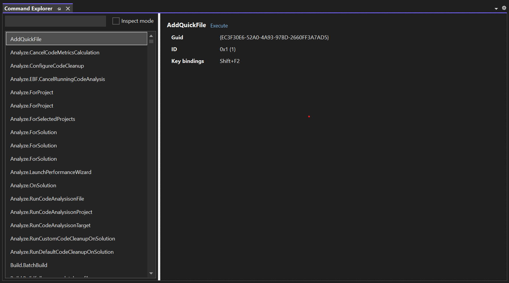

# Command Explorer 

This extension shows the group and menu identifiers of existing commands to make it easy to find out where to place your custom commands.

Download this extension from the [Marketplace](https://marketplace.visualstudio.com/items?itemName=MadsKristensen.CommandExplorer)
or get the [CI build](http://vsixgallery.com/extension/1a973c52-a674-48d8-a276-65ddab1ac598/).

## Open the tool window
Click on **View -> Other Windows -> Command Explorer** to show the tool window.

Use the filter text box at the top of the command list to easily find the command you're looking for.

## Inspect mode
This checkbox allows you to point at any command in any menu, toolbar or context menu to select it.

Once enabled, you can now **CTRL+Shift+Left-Click** any command and it will select the command you clicked on in the command list.

## License
[Apache 2.0](LICENSE) 